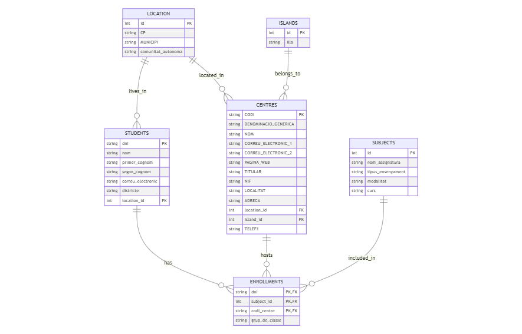

# Database Design Analysis

## 1. Entity Analysis

### 1.1 Centres (Centers)
**Primary Key:** `CODI`
**Attributes:**
- `CODI` (Code) - Unique identifier for each center
- `DENOMINACIÓ GENÈRICA` (Generic Denomination)
- `NOM` (Name)
- `CORREU ELECTRÒNIC 1` (Email 1)
- `CORREU ELECTRÒNIC 2` (Email 2)
- `PÀGINA WEB` (Website)
- `TITULAR` (Owner)
- `NIF` (Tax ID)
- `LOCALITAT` (Location)
- `MUNICIPI` (Municipality)
- `ADREÇA` (Address)
- `CP` (Postal Code)
- `ILLA` (Island)
- `TELEF1` (Phone 1)

**Constraints:**
- `CODI` must be unique and not null
- `NIF` should follow the Spanish tax ID format
- `CP` should be a valid postal code format
- At least one email address should be provided

### 1.2 Students
**Primary Key:** `dni`
**Attributes:**
- `dni` - National ID number
- `nom` (Name)
- `primer_cognom` (First Surname)
- `segon_cognom` (Second Surname)
- `correu_electronic` (Email)
- `codi_postal_i_districte` (Postal Code and District)
- `comunitat_autonoma` (Autonomous Community)
- `municipi` (Municipality)

**Constraints:**
- `dni` must be unique and not null
- `nom`, `primer_cognom` must not be null
- `correu_electronic` must be unique and follow email format
- `codi_postal_i_districte` must follow the special format mentioned

### 1.3 Enrollments (Matriculacions)
**Primary Key:** Composite (`dni`, `nom_assignatura`, `codi_centre`)
**Attributes:**
- `dni` - Student's National ID
- `tipus_ensenyament` (Education Type)
- `modalitat` (Modality)
- `curs` (Course)
- `nom_assignatura` (Subject Name)
- `grup_de_classe` (Class Group)
- `codi_centre` (Center Code)

**Constraints:**
- `dni` must exist in Students table (Foreign Key)
- `codi_centre` must exist in Centres table (Foreign Key)
- Combination of `dni`, `nom_assignatura`, and `codi_centre` must be unique
- All fields except `grup_de_classe` are mandatory

## 2. Relationships

1. **Student-Enrollment Relationship**
   - One-to-Many: A student can have multiple enrollments
   - Mandatory for Enrollment (can't exist without a student)
   - Optional for Student (can exist without enrollments)

2. **Centre-Enrollment Relationship**
   - One-to-Many: A center can have multiple enrollments
   - Mandatory for Enrollment (can't exist without a center)
   - Optional for Centre (can exist without enrollments)

## 3. Additional Considerations

1. **Postal Code and District Format**
   - Special handling needed for `codi_postal_i_districte` in Students table
   - Should be stored in a way that allows efficient querying for proximity-based searches

2. **Academic Year Handling**
   - Although not explicitly in the structure, enrollments are regenerated each academic year
   - Consider adding academic year field for historical tracking

3. **Contact Information**
   - Multiple email addresses for centers
   - Single email for students
   - Phone number format standardization

## 4. Actual ER Diagram

[Mermaid](https://mermaid.live/) code to generate the ER Diagram:

```
erDiagram
    CENTRES {
        string CODI PK
        string DENOMINACIO_GENERICA
        string NOM
        string CORREU_ELECTRONIC_1
        string CORREU_ELECTRONIC_2
        string PAGINA_WEB
        string TITULAR
        string NIF
        string LOCALITAT
        string MUNICIPI
        string ADRECA
        string CP
        string ILLA
        string TELEF1
    }

    STUDENTS {
        string dni PK
        string nom
        string primer_cognom
        string segon_cognom
        string correu_electronic
        string codi_postal_i_districte
        string comunitat_autonoma
        string municipi
    }

    ENROLLMENTS {
        string dni PK, FK
        string tipus_ensenyament
        string modalitat
        string curs
        string nom_assignatura
        string grup_de_classe
        string codi_centre PK, FK
    }

    STUDENTS ||--o{ ENROLLMENTS : "has"
    CENTRES ||--o{ ENROLLMENTS : "hosts"
```


# Database Normalization

## Current Normalization Issues

1. **In CENTRES table:**
   - Location data (`MUNICIPI`, `CP`, `ILLA`) represents a potential multivalued dependency

2. **In STUDENTS table:**
   - Location data (`comunitat_autonoma`, `municipi`, `codi_postal_i_districte`) represents a potential multivalued dependency

3. **In ENROLLMENTS table:**
   - Academic information (`tipus_ensenyament`, `modalitat`, `curs`, `nom_assignatura`) shows potential partial dependencies

## Normalized Structure

### 1NF (Already Satisfied):
- All attributes are atomic
- No repeating groups
- Primary keys identified

### 2NF and 3NF Normalized Structure:

1. **LOCATION** (Extracted from both CENTRES and STUDENTS)
```sql
Primary Key: (ID)
- ID
- CP
- MUNICIPI
- comunitat_autonoma
Unique (CP, MUNICIPI, comunitat_autonoma)
```

2. **CENTRES**
```sql
Primary Key: CODI
- CODI
- DENOMINACIÓ GENÈRICA
- NOM
- CORREU_ELECTRÒNIC_1
- CORREU_ELECTRÒNIC_2
- PÀGINA_WEB
- TITULAR
- NIF
- LOCALITAT
- ADREÇA
- location_id (FK to LOCATION)
- island_id (FK to ISLANDS)
- TELEF1
```

3. **STUDENTS**
```sql
Primary Key: dni
- dni
- nom
- primer_cognom
- segon_cognom
- correu_electronic
- codi_postal_i_districte (split during data insertion to match LOCATION and leave here district)
- location_id (FK to LOCATION)
```

4. **SUBJECTS**
```sql
Primary Key: (id)
- id
- nom_assignatura
- tipus_ensenyament
- modalitat
- curs
Unique (nom_assignatura, tipus_ensenyament, modalitat, curs)
```

5. **ENROLLMENTS**
```sql
Primary Key: (dni, subject_id, codi_centre)
- dni (FK to STUDENTS)
- subject_id (FK to SUBJECTS)
- codi_centre (FK to CENTRES)
- grup_de_classe
```

6. **ISLANDS**
```sql
Primary Key: (id)
- id
- illa
```

## Final ER Diagram

[Mermaid](https://mermaid.live/) code to generate the ER Diagram:

```
erDiagram
    LOCATION {
        int id PK
        string CP
        string MUNICIPI
        string comunitat_autonoma
    }

    ISLANDS {
        int id PK
        string illa
    }

    CENTRES {
        string CODI PK
        string DENOMINACIO_GENERICA
        string NOM
        string CORREU_ELECTRONIC_1
        string CORREU_ELECTRONIC_2
        string PAGINA_WEB
        string TITULAR
        string NIF
        string LOCALITAT
        string ADRECA
        int location_id FK
        int island_id FK
        string TELEF1
    }

    STUDENTS {
        string dni PK
        string nom
        string primer_cognom
        string segon_cognom
        string correu_electronic
        string districte
        int location_id FK
    }

    SUBJECTS {
        int id PK
        string nom_assignatura
        string tipus_ensenyament
        string modalitat
        string curs
    }

    ENROLLMENTS {
        string dni PK, FK
        int subject_id PK, FK
        string codi_centre PK, FK
        string grup_de_classe
    }

    LOCATION ||--o{ CENTRES : "located_in"
    LOCATION ||--o{ STUDENTS : "lives_in"
    ISLANDS ||--o{ CENTRES : "belongs_to"
    STUDENTS ||--o{ ENROLLMENTS : "has"
    CENTRES ||--o{ ENROLLMENTS : "hosts"
    SUBJECTS ||--o{ ENROLLMENTS : "included_in"
```

